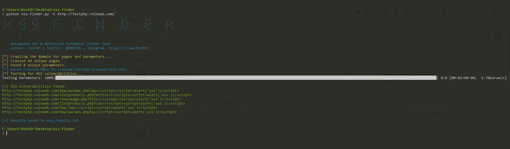

   

# XSS Finder

**XSS Finder** is an automated tool designed for detecting reflected Cross-Site Scripting (XSS) vulnerabilities in web applications. It crawls websites, extracts URL parameters, and tests them using various XSS payloads to identify potential vulnerabilities. This tool is designed for penetration testers and security researchers to enhance web application security.

## Features

- **Automated Crawling**: Crawls the target domain, identifies internal pages and URL parameters.
- **Customizable Payloads**: Includes a variety of XSS payloads to test parameters for reflected XSS vulnerabilities.
- **Parallel Testing**: Utilizes multithreading to speed up the testing process.
- **Results Logging**: Saves identified vulnerabilities and crawled URLs in text files for easy reference.

## Installation

#### Prerequisites

Ensure that you have Python 3.x installed. Additionally, you will need to install the required dependencies.

#### Install Dependencies

Clone the repository and install dependencies using pip:

`git clone https://github.com/rootDR/xss-finder.git`

`cd xss-finder`

`pip install -r requirements.txt`

#### Run the script with the following command:

`python xss_finder.py -t http://example.com`

#### Arguments
-t, --target : Required. The target domain to scan (e.g., http://example.com).
-s, --subdomains : Optional. Crawl subdomains as well.

Example:
`python xss_finder.py -t http://example.com -s`

### How It Works

##### 1- Crawling: The script crawls the target domain (and optionally subdomains), collecting URLs and GET parameters.
##### 2- Testing: For each parameter, the tool injects different XSS payloads to check if they trigger a reflected XSS vulnerability.
##### 3- Reporting: Any discovered vulnerabilities are logged in xss_results.txt, and crawled URLs are saved in crawled-<target_domain>-crawled-urls.txt.

#### Results
xss_results.txt: Contains a list of URLs with reflected XSS vulnerabilities.
crawled-<target_domain>-crawled-urls.txt: Lists all crawled URLs for the target domain.

